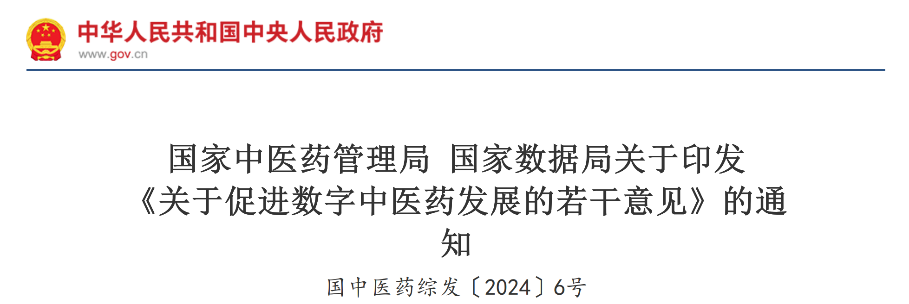

各省、自治区、直辖市中医药、数据主管部门，新疆生产建设兵团卫生健康委、数据局：

为贯彻落实中共中央、国务院《关于促进中医药传承创新发展的意见》《数字中国建设整体布局规划》《关于构建数据基础制度 更好发挥数据要素作用的意见》等文件精神，推动《"数据要素X"三年行动计划(2024-2026年)》落实落地，充分发挥数据要素乘数效应，释放中医药数据价值，赋能中医药高质量发展，国家中医药管理局会同国家数据局制定了《关于促进数字中医药发展的若干意见》，现印发给你们，请结合实际认真贯彻落实。

国家中医药管理局 国家数据局
2024年7月19日

---

# 关于促进数字中医药发展的若干意见

为贯彻落实中共中央、国务院《关于促进中医药传承创新发展的意见》《数字中国建设整体布局规划》《关于构建数据基础制度 更好发挥数据要素作用的意见》等文件精神，推动《"数据要素X"三年行动计划(2024-2026年)》落实落地，充分发挥数据要素乘数效应，释放中医药数据价值，赋能中医药高质量发展。现提出如下意见。

## 一、总体要求

以习近平新时代中国特色社会主义思想为指导，全面贯彻落实党的二十大和二十届二中、三中全会精神，深入学习贯彻习近平总书记关于中医药工作的重要论述，完整、准确、全面贯彻新发展理念，深刻把握数据要素基本特征和战略地位，以提升中医药行业数字化思维为切入点，以提高中医药服务质量和效率为主线，以发挥中医药数据的赋能作用为导向，用3-5年时间推动大数据、人工智能等新兴数字技术逐步融入中医药传承创新发展全链条各环节，促进中医药数据的共享、流通和复用，初步实现中医药全行业、全产业链、全流程数据有效贯通，全力打造"数智中医药"，为数字中国建设提供中医药实践，为中医药现代化发展提供有力支撑。

## 二、夯实数字中医药工作基础

1.  **建立健全中医药数据标准规范**。推进中医药数据分类分级管理，推进中医药多源数据融合标准规范制定和示范应用，形成有利于中医药数据协同优化、复用增效、融合创新的标准规范体系。探索中医药数据确权授权使用、收益分配机制和市场化流通交易等制度体系建设。
2.  **强化中医药数据治理基础**。加强中医药行业数字基础设施建设，提高数据采集、生产和治理能力。鼓励运用大数据、人工智能等新技术在中医药医疗、科研、教育、产业、文化等领域开展适用性研究，打造中医药大模型等行业数字技术底座。鼓励中医药行业加强数据共享开放，推动中医药数据流通交易，打造中医药数据创新利用生态体系。
3.  **加强中医药数据安全保障**。实施数据分类分级保护，建立中医药数据流转、开发利用安全规范和安全风险评估机制，保障数据采集、传输、存储、处理、流通、使用过程中的数据安全，构建风险可控可信的数据流通安全环境，落实数据安全主体责任，明确行业主管部门、数源单位与用数单位的数据安全职责边界，推动数据安全规范化、标准化，保障中医药数据有序流通。
4.  **加快中医药数字化人才培养**。强化中医药行业数字化教育培训，全面提升数字化思维。鼓励相关高校开设具有中医药特色的数据科学和人工智能类专业，科学设定培养目标，优化教学内容，培养善于"转化数据、研究数据、挖掘数据、运用数据"的复合型人才，为中医药数字化发展打造坚实人才底座。

## 三、数字化赋能中医药高质量发展

### (一) 数字化辅助中医服务能力提升

5.  有序释放中医医疗数据价值，赋能中医医疗服务水平提升。鼓励中医医疗机构推动业务流程数字化转型，打造集预防、治疗、康复、个人健康管理于一体的数字中医药服务模式，推进中医诊疗服务全流程多源数据采集和融合治理，建立统一的数据共享标准规范，推动疾病治疗全过程高质量数据闭环管理，为辅助临床医生诊断和治疗提供中医药数据资源。鼓励研发具有中医药特色的智能电子病历、智能预诊随访等系统，提升中医药数据智能化采集能力，应用数字化手段采集具有临床结局的专科专病全流程高质量数据，通过临床疗效的反馈，不断优化总结诊疗方案，提高临床诊疗水平。
6.  推动中医医疗数据融合创新，赋能中医医疗智慧化管理高质量发展。推动中医医疗机构以及相关县域医共体成员单位内部数据共享复用，实现中医临床诊疗、中医临床科研、中医临床教学、个人健康管理档案等数据资源合规高效利用，探索建立中医医疗质量智能化监测体系，拓展智慧医疗、智慧服务、智慧教育、智慧管理等数据应用新模式新业务，打造一批具有示范性的智慧中医医院、中医数字医共体和临床教学基地。
7.  提升群众看病就医便利度。推进中医医疗机构电子病历数据互联互通，实现患者院前、院中、院后诊疗数据贯通以及院内外合规高效调用，促进检查检验结果互认共享，提高医疗资源利用效率。优先围绕中医优势专科和优势病种开展诊疗全流程数据采集、使用和治理，形成应用示范。鼓励建设具有示范性的智能化中药房、区域智慧共享中药房，提供云煎药服务，为群众提供方便快捷精准的中医药服务。
8.  助推中医药健康管理。鼓励利用大数据、人工智能等新兴数字技术研发中医健康监测设备和治未病健康管理平台，通过中医体质等中医数据采集记录，整合体检、疾控等数据，开展主动健康管理、个人健康画像、人工智能+医疗健康应用、重点人群健康保障、卫生健康决策支持系统建设与数据应用示范研究，充分发挥中医养生保健优势。

### (二) 数字化助力中医药人才培养

9.  推动名老中医诊疗数据开放共享。鼓励中医医疗机构应用数字技术建设"数字化传承工作室""数字诊室"等，利用数字技术复现名老中医诊疗过程和诊疗思路，数字化记录教学行为，总结跟师学习、临床实践和疗效跟踪等经验，推动名老中医学术传承创新发展。
10. 推动中医药教育数字化发展。推进中医药数字化教育教学资源建设，包括中医药精品在线开放课程建设、名医大师课程实录及影音资源数字化保护、中医药虚拟仿真实验实训平台建设、数字化临床基地和智慧教学环境建设等。提升中医药专业人才的数字化素养与应用技能，丰富知识结构，适应数字化时代发展要求。

### (三) 数字化支撑中医药科技创新

11. 推动中医药科学数据应用。加强中医药科技文献检索、利用，推进中医药科学数据共享，支持和培育具有国际影响力的中医药科学数据库建设，为开展中医药临床试验提供支撑，以数据驱动助力中医药临床研究、数字疗法研究、智能药物筛选和中药新药研发等任务。
12. 探索中医药科研新范式。鼓励中医医疗机构与科研机构、信息技术企业、中药企业合作，加大对临床中医诊疗真实世界数据和循证医学数据的采集与利用，推动临床专科专病知识库建设，开展临床疗效评价，以数据驱动发现新规律，打造中医临床研究新范式，为疾病分级、疾病监测预测、诊疗方案完善、中药疗效和安全性评估等提供真实世界证据。
13. 以中医药科学数据助推技术创新。鼓励中医药科研机构与大学、企业等合作，充分利用名老中医临床诊疗数据、实验数据、科技文献和古籍文献等，结合不同场景开展人工智能大模型开发、训练和应用，重点攻关中医药行业多源数据智能化、网络化采集技术、装备研究，鼓励研发适合基层医疗机构使用的数字化、智能化产品，推动中医临床智能辅助决策系统与智能诊治装备研发与推广应用。

### (四) 数字化赋能中药产业高质量发展

14. 推动中药全产业链数据协同。加快中药全产业链数字化驱动，强化中药质量追溯体系平台建设和推广运用，借助大数据、物联网、区块链等技术，推动从中药材种植生态环境、农事管理、采收、加工炮制、包装、仓储、养护、流通储存到处方流转、审方、调剂、配送、临床应用及效果评估全生命周期数据的互联互通和合理利用，赋能中药产品质量管理。
15. 提升中药生产数智化水平。支持利用遥感、气象、土壤等数据，打造以数据、模型为支撑的中药生态种植数智化场景，赋能中药材育种、育苗和种植养殖。推动数字化车间、数字孪生工厂、智慧物流、智慧库房、工业互联网等建设应用，提升中药企业创新能力和生产效率。

### (五) 数字化助推中医药文化传播和对外交流合作

16. 助力中医药文化传播。支持建立中医药古籍数据库、中医药文物数据库、中医药知识库，建设中医药教育文化服务数字化基础设施和服务平台，研究推动中医药图书、期刊、报纸、媒体、网站数字化转型，开展中医药非物质文化遗产数字化保护，推进中医药数字图书馆、中医药数字博物馆等线上线下数字化场馆建设，创新中医药文化传播途径，利用数字化手段为群众提供更丰富的中医药文化服务。
17. 推进中医药对外交流合作。支持中医药服务出口基地建立中医药数字贸易平台，推动中医药贸易数字化发展。利用数字化手段开展跨境医疗、远程教学、中药国际多中心临床研究等工作。支持开展传统医药数据跨境监管机制交流与合作。

### (六) 数字化协助中医药治理水平提升

18. 提高中医医疗机构智慧管理水平。强化中医医疗机构数据基础建设，推动中医药业务和管理数据自动化采集、智能化治理和数据分析挖掘应用，支撑开展中医药疗效、安全性、卫生经济学、患者满意度、绩效管理等综合评价，借助人工智能等技术分析医疗数据，支撑对中医医疗服务质量、机构运行情况、绩效管理、科研管理、职称评审等考核评估工作。
19. 建立中医药公共数据服务平台。健全国家中医药综合统计体系，建立中药材生产调查、中医药监督执法统计等专项制度，联通和汇聚各地中医药公共数据，推动全国范围内实现中医医师资格查询、中医医疗机构资质查询等中医药公共服务数据高效调用。加强对重大项目、重大工程、重点任务及重大政策、规划等数据采集与管理，开展实施效果评估，为公共管理决策提供技术支持。
20. 支撑中医药科学决策。推动中医药多维数据融合，构建中医医疗服务和中药质量监测评估体系，推动相关领域数据共享，支撑临床诊疗指南修订、临床医疗质量评估、等级医院评审、人才评定等，提升决策科学化、精准化水平，提高中医药行业治理水平和监管效能。

## 四、强化数字中医药工作组织实施

各级中医药、数据主管部门应加强对数字中医药工作的领导，统筹协调、整体推进、督促落实，健全议事协调机制，将数字化发展摆在本地区工作重要位置，切实落实责任。积极将数字化相关重大政策、重大工程和重大项目的定量评价等内容纳入绩效考核、职称评审、人才评定等制度中，推动中医药数据共享流通，释放中医药数据价值。组织召开数字中医药推进现场会，加强中医药数字化转型典型场景经验挖掘、推广与交流。组织开展中医药数字化、智能化相关竞赛，形成以赛创新、以赛促用的产学研用合作格局。通过试点示范等方式，鼓励有条件的地区在制度建设、技术路径、发展模式等方面先行先试，推动中医药工作从传统业务和管理模式向数据驱动模式转变。信息化、数字化基础较为薄弱的地区，应着力补短板、强弱项，夯实信息化、数字化基础性工作。

---

## 公文基础信息

| 项目     | 内容                                                                          |
| :------- | :---------------------------------------------------------------------------- |
| 标题     | 国家中医药管理局 国家数据局关于印发《关于促进数字中医药发展的若干意见》的通知 |
| 发文机关 | 国家中医药局、国家数据局                                                      |
| 发文字号 | 国中医药综发(2024)6号                                                         |
| 主题分类 | 卫生、体育\医药管理                                                           |
| 成文日期 | 2024年07月19日                                                                |
| 来源     | 国家中医药局网站                                                              |
| 公文种类 | 通知                                                                          |