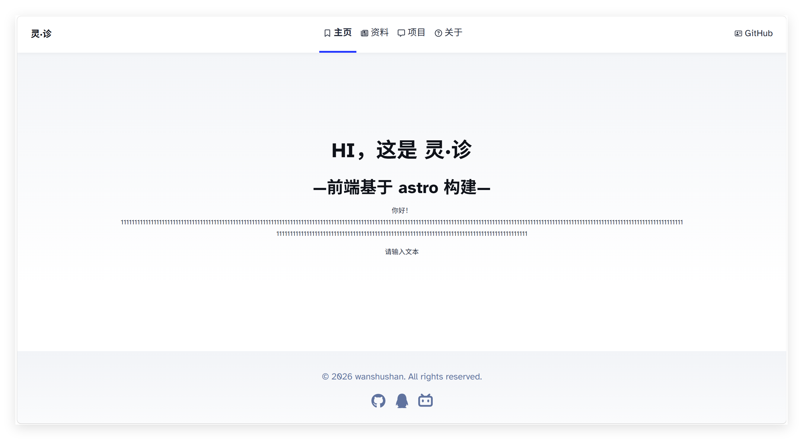

# 灵·诊 项目说明

## 前端
- 基于 astro 构建
- 实现了主页，资料，聊天，用户页，关于页，登录页
- 登录页有点粗糙，后续可以美化一下
- 聊天功能目前只是前端展示，后续需要对接后端接口
- 后续可能需要做美化和增加功能

## 后端
- 暂时用fastapi
- 已经写好了登录注册的接口，后续要加上聊天储存以及模型处理的接口
- 用户数据暂时存储在json文件中，后续可以考虑换成数据库
- 聊天记录我暂时直接存在前端文件中md文档里了，后续可以考虑放进后端
- 不想搞数据库的话，直接存也可以（doge）

## 模型训练
- 暂定yolo26与pytorch


## 网络服务
- 部署可以考虑frp加nginx反代，或者直接部署在云服务器上，后续再看情况调整


## 其他注意事项

- 目前前端和后端代码分开，前端在 `FE` 目录下，后端在 `RD` 目录下
- 模型训练等在`ML`目录下
- 所有的部分都记得要写readme.md，说明项目结构和使用方法
- 模型训练请保留训练日志以及训练数据，方便后续分析和改进
- 如果RD也用python的话，记得与ML部分版本保持一致，避免依赖冲突
- 可以拉取完整代码作调试用，但请不要直接提交PR到主分支
- RD与ML另外单独建立仓库，最好仅包含RD或ML文件夹，避免最后合并时出现冲突
- 所有的路径请使用相对路径，避免不同环境下路径不一致导致的问题
- 完整项目仓库在：https://github.com/wanshushan/TG 与 https://gitee.com/wanshu-mountain/TG
- 使用AI写的代码请一定确认你知道这是做什么的，并且不要让AI改栋除去你负责的部分的代码


# 使用说明

## 环境配置

### RD（fastapi）
- 使用 Conda 创建独立环境，命名为 `RD`
- 安装依赖(依赖文件freeze.yml)：
    ```   powershell
    conda create -n RD python=3.13 -y
    conda activate RD
    conda env update -f freeze.yml --prune
    ```
- python版本3.13，模型训练部分请确保与后端环境一致，避免依赖冲突

### FE（astro）

- 安装 Node.js
- npm install安装依赖
- npm run dev 启动开发服务器

## 启动

- 先启动RD
    ```   powershell
    cd RD
    conda activate RD（这里改成你的环境名）
    uvicorn main:app --host 127.0.0.1 --port 3000 
    ```
- 再启动FE

    ```   powershell
    cd FE
    pnpm dev (或者 npm run dev)
    ```

- 访问 http://127.0.0.1:4321/

- 有默认用户密码 admin2/admin2
- 聊天那一块手下留情一点🙏，我只充了10块钱的api，可以使用本地ollama服务玩一玩